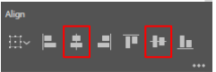
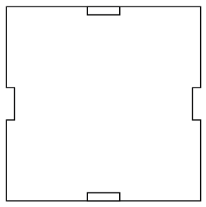

# Laser Cut Cube

**Overview:**

For this project, you'll start by making two of the six sides of the cube. Then,  you'll just make copies of those two side in order to complete the cube. You will be “cutting” off pieces of each shape so that they fit together with "tabs." Once laser cut, the piece should make a 3"x3"x3" cube.

**Set-Up:**&#x20;

* Create a new **Project** in Adobe Illustrator and set the width to **24 in and the height to 12 in**.

<figure><figcaption></figcaption></figure>

**Create Your First Square**

* Start by adding a rectangle to the artboard using the **Rectangle** tool .
* Click and drag with the mouse to create the rectangle.&#x20;
* Change the dimensions so that the **height and the width are 3 in**.

&#x20;

<figure><figcaption></figcaption></figure>

<figure><figcaption></figcaption></figure>

You should now have a **3 in by 3 in square**.&#x20;

**Create the "tabs" for the top and bottom of your cube**

* You'll now make the piece that you will use to “cut” off pieces from the square. (These will become "tabs" to fit the sides of your cubes together once all the pieces are cut.)
* Make a new rectangle that is .5 inch wide by .125 in high.
* Make a copy of it \[Ctrl+C then Ctrl+V]
* Select the 3 in by 3 in square and the two rectangles. The **align** option should appear on the right hand side. Select **Center Horizontally** and **Center Vertically**

<figure><figcaption></figcaption></figure>

<figure><figcaption>
<strong>The square and rectangles are now centered</strong>
</figcaption></figure>

Select the square and one of the rectangles. Then, using the align options, select **Vertical Align Top**&#x20;

<figure><figcaption></figcaption></figure>

<figure><figcaption>
It should look like this
</figcaption></figure>

Select the square and the rectangle left on the center and select the Vertical Align Bottom option.\

<figure><figcaption></figcaption></figure>

<figure><figcaption>
<strong>This is the result</strong>
</figcaption></figure>

* Select the square and the rectangles and then chose the **Shape Builder Tool** on the left side of the screen
* Click on the inside part of the square to create a new shape.
* Using the **Selection Tool**  click anywhere outside the square, then select the square.
* **Rotate** the square 90 degrees. If you hold down the Shift key as you rotate, the shape will rotate in 45 degree increments

<figure><figcaption></figcaption></figure>

*   Select the square and the rectangles and then chose the **Shape Builder Tool** on the left side of the screen and click on the inside part of the square to create a new shape

    <figure><figcaption></figcaption></figure>
* Using the **Selection Tool**  click anywhere outside the square, then select the square and move it. We will use this for the top of the cube.&#x20;
* Next, create a **copy** of this shape to use as the bottom of the cube.

**Create the sides (four faces) of your cube**

* Create another 3 by 3 square
* Create a rectangle that is .125 wide by .5 high
* Make a copy of each of the rectangles, so you now have two of each.
* Select the four rectangles and the new 3 by 3 square and select **Center Horizontally** and **Center Vertically**

<figure><figcaption></figcaption></figure>

* Select the square and one of the horizontal rectangles. Then, using the **align** options, select **Vertical Align Top**Select the square and the other horizontal rectangle left in the center and select the **Vertical Align Bottom.**

<figure><figcaption></figcaption></figure>

\

<figure><figcaption>
<strong>This is what you should have so far</strong> 
</figcaption></figure>

* Select the square and one of the vertical rectangles then using the align options select the **Horizontal Align Left** option

<figure><figcaption></figcaption></figure>

* Select the square and the other vertical rectangle left on the center and select the **Horizontal Align Right** option.

<figure><figcaption></figcaption></figure>

\

<figure><figcaption>
Y<strong>ou should have this</strong>
</figcaption></figure>

* Focus on the top part of the square, hold down the **Alt** key, drag the rectangle to the left, and as you are dragging hold down the **Shift** key, without letting go of Alt, so that the rectangle moves in a straight line. Drag the rectangle until it is touching the left side of the square (a pink “intersect” will appear when it happens).

<figure><figcaption></figcaption></figure>

* Drag the right side of the rectangle you just moved, until it touches the left side of the rectangle in the center.

<figure><figcaption></figcaption></figure>

* Select the center rectangle and drag its left side until it touches the right side of the big square.

<figure><figcaption></figcaption></figure>

*   Focus on the bottom part of the square, hold down the **Alt** key, drag the rectangle to the left and as you are dragging hold down the **Shift** key, without letting go of Alt, so that the rectangle moves in a straight line. Drag the rectangle until it is touching the left side of the square (a pink “intersect” will appear when it happens).

    <figure><figcaption></figcaption></figure>
*   Drag the right side of the rectangle you just moved, until it touches the left side of the rectangle on the center.

    <figure><figcaption></figcaption></figure>
* Select the center rectangle and drag its left side until it touches the right side of the big square.

<figure><figcaption></figcaption></figure>

* Focus on the left part of the square, hold down the **Alt** key, drag the rectangle to the bottom and as you are dragging hold down the **Shift** key, without letting go of Alt, so that the rectangle moves in a straight line. Drag the rectangle until it is touching the bottom side of the square (a pink “intersect” will appear when it happens).

\

* Drag the top of the rectangle you just moved, until it touches the bottom center of the rectangle

* Select the center rectangle and drag its bottom side until it touches the top side of the big square

\

<figure><figcaption>
You should have this
</figcaption></figure>

* Select the square and the rectangles and then chose the **Shape Builder Tool** on the left side of the screen and click on the inside part of the rectangle to create a new shape

<figure><figcaption></figcaption></figure>

* You will use this for one of the sides of the cube.
* **Create 3 copies** of this for the other sides.
* Delete all the other small rectangles so that you are left with just the two pieces \[top/bottom and sides] you created.

**Set the correct colors / line thickness for laser cutting.**&#x20;

* The laser cutter recognizes only three colors: black (infill), blue (outline) and red (cut).&#x20;
* **Select all of the shapes** and set the **Stroke**  to **Red (R:255,G:0,B:0)** and the **thickness**  **to .001.**  This tells the laser cutter to cut along the red lines of your shape.&#x20;

**Add images to your cube** \

You can now add black and white images of your choice to the sides of the cube.

* Look for black and white images on Google and save them using Save Image As. Or, save images you've created to the computer.&#x20;
* Go back to Illustrator and go to **File->Place**…
* Choose your image and click anywhere on the screen to place it. Do not resize the image yet.&#x20;
* Select the image, click the **Image Trace** button on the right side of the screen and select **Black and White Logo**

* Click the **Expand** button

<figure><figcaption></figcaption></figure>

* Place the image on one of the cube pieces (top, bottom, or one of the sides). You can now resize the image to fit within the square.&#x20;
* Repeat the previous steps, adding images to the sides, top, and bottom as desired.
* Save your file and either email it to yourself or put it on a USB to transfer it to the laser cutting PC.&#x20;
