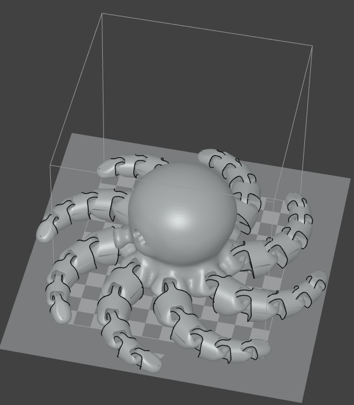
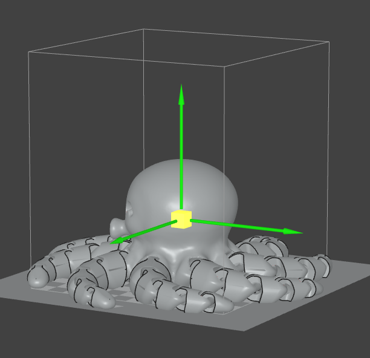
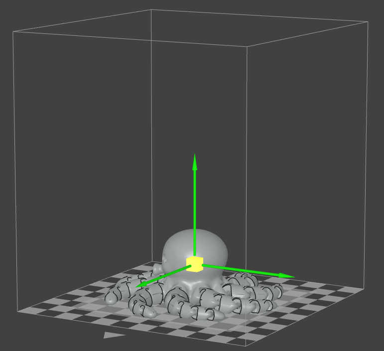
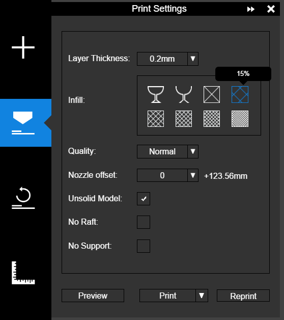
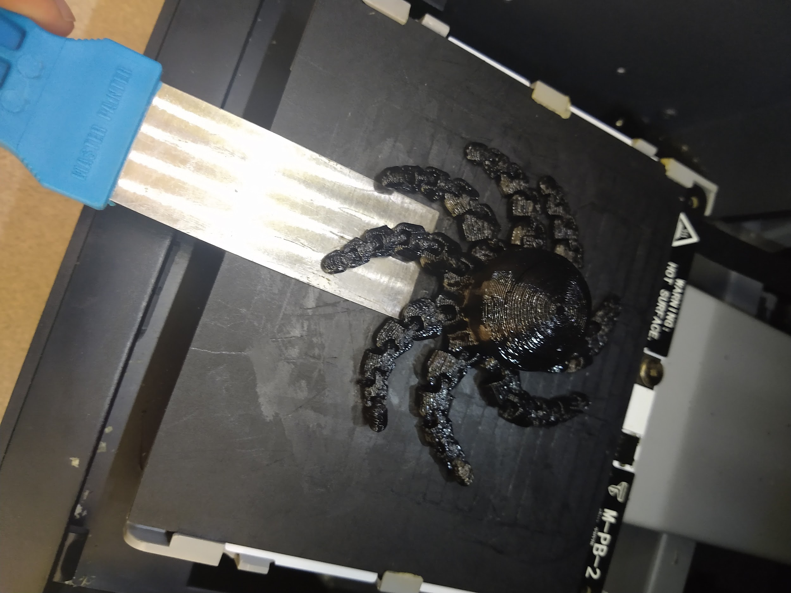

# 🧊 3D Modeling & Printing

## **Using the UpMini 3D Printers**

**Download the File to Print**

* Download an .stl file to print. It can be something you created using a CAD software such as [Tinkercad](https://www.tinkercad.com/) or a file you found on a website like [Thingiverse](https://www.thingiverse.com/).
* Make a note of where the file was downloaded and the name of the file so that you can locate it easily.

**Using the Printer Software**

* The UpMini has a small print bed ideal for printing small 3D models such as figures and small parts. It requires little set-up to start printing.
* Turn on the printer by flipping the switch on the back of the printer.
* Locate the **UpStudio** software on the computer and open it.

.png>)

* Click the **UP icon** on the left side of the screen

.png>)

* You will be taken to the printing page, where you will see the printing bed (the checkered pattern) and the available printing space represented by the box around the print bed. The gray triangle represents the front of the print bed. The model must fit inside the print space or the UpMini will not be able to print it. If the model does not fit, it will need to be resized.

.png>)

* Click the **Initialize Printer** button on the left side of the screen to get the printer ready.

.png>)

* While the printer is initializing, add your model by clicking the **Add (+)** sign and then clicking **Add 3D Model**. When the dialog box appears, open your .stl file, and the model will be loaded to UpStudio.

.png>)

* **Setting up the Model**
  * When the model is loaded, check that it fits inside the printing space. If any part of the model is outside the printing space, the model must be made smaller.

* Click the **Scale** button, making sure that the lock button is highlighted blue to keep the proportions of the model when shrinking it.

.png>)

* To shrink the model, click and hold any of the arrows that appear on the model and drag it into the model. Do this until the model is completely inside the printing space.

 

* If the model fits in the printing space and there is still some room, you can also make the model bigger. Go to **Scale** and drag any of the arrows out of the model, making sure that all of the model stays within the printing space.

.png>) .png>)

* Once the model has been resized and fits in the printing space, click the **Move** button and click **Drop** to print bed. This makes sure that the model sits correctly on the print bed. Otherwise, the model may not be printed correctly and you will end with a failed print.

.png>)

**Getting Ready to Print**

* Click the **Print** button, and the **Print Settings** will appear. Make sure that the **Layer Thickness** is set to 0.2mm, the **Infill** set to 15%, and the **Quality** is Normal. Leave Nozzle offset as it is. Make sure the **Unsolid Model** is checked and that both the **No Raft** and **No Support** boxes are unchecked.

* Click the **Preview** button at the bottom left of the Print Settings. This will give you an estimate of how long it will take to print the model. **Make sure that your print will finish before the EDGE Lab closes. We will not leave printers running after hours.**
* Click the **Exit Preview** button. Then go back to **Print** and click the Print button and the button at the bottom of the Print Settings. The model will be sent to the printer to print. Make sure that the printer door is closed.
* As the model is being printed check back on it periodically to make sure nothing has gone wrong while printing. If something goes wrong, press the **Pause** button on the printer and stop the print. Inform the Edge Lab Facilitator or EDGE Lab TA of what happened, so that he/she can help you fix the problem. The print will have to be started again, so there might not be time to print it that same day.

**Unloading the Print**

* When your print is done, the printer will beep. Open the printer door, ask for a scraper, and remove the print from the print bed by carefully scraping in between the print bed and the model. If you don’t feel comfortable doing this, ask the Edge Lab Facilitator or a TA for help.

.jpeg>) 

* Delete your model from UpStudio by clicking the model and pressing the **Delete** key on the keyboard.Then, close UpStudio.
* If you are unable to stay during the whole time that the model is printing, inform the Edge Lab Facilitator or TA, so that they can check the print while you are gone to make sure nothing goes wrong / take the model out once it is done.
* Once the model has been removed from the printer it will have some excess material that you will have to take off.

### **Loading and Unloading Filament**

* If there is no filament or not enough, you have to load a new roll. Ask the Edge Lab Facilitator or TA for a new roll of filament. You can also ask for a specific color.

**Unloading**

* Open the top of the UpMini by removing the top panels
* Click the **Maintenance** button and then click the **Withdraw** button.
* The printer will heat up the extruder tip, which will take a few minutes. The printer will beep once it has reached the correct temperature.
* Once the printer starts to withdraw the filament, the filament will start to move upwards. Once the filament stops moving, pull on it lightly and slowly to remove all of the filament from the printhead. **NOTE: Don’t yank too hard on the filament as you’re removing it. This can cause the filament to break and clog.**
* Pull the filament out of the guiding tube and take the spool out of the holder.

**Loading**

* Place the new spool in the holder.
* Feed the filament through the guiding tube until it comes out the other end.
* Open the top of the UpMini by removing the top panels
* Click the **Maintenance** button and then click the **Extrude** button.
* The printer will heat up the extruder tip, which will take a few minutes. The printer will beep once it has reached the correct temperature.
* Once the printer starts to move the motors, carefully guide the filament into the printhead.
* Once you feel the motor pulling on the filament, let go of the filament to prevent any grind on the filament.
* Once filament starts to extrude, press the **Stop** button and remove the extruded filament from the print bed.
* If no filament was extruded, press the **Extrude** button one more time. If it’s still not extruding, please let the EDGE Lab Facilitator or TA know.
