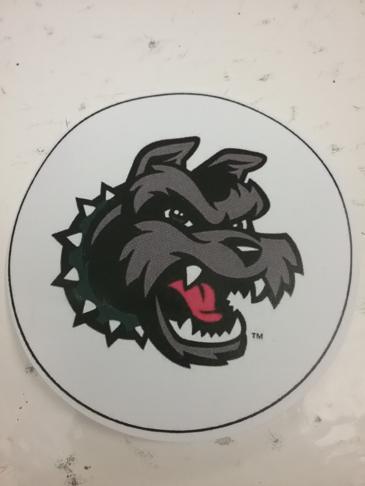

# 🔘 Buttons&#x20;

### **PART ONE: Create Your Design**

1. **Go to:** [**www.americanbuttonmachines.com**](http://www.americanbuttonmachines.com/)
   * **username: helixedgelab@gmail.com**
   * **password: libedge01**
2. **Choose “Design Center” --- “Use Build-A-Button”**
   * Select button size: **2.25”**
   * Add text / images to design your button! (To add pics: you’ll need to SAVE your image to your computer and then choose “Photos” - from the left menu - to upload image). You can’t copy/paste images into the Design Center.
   * When your button design is done: click “**SAVE & PRINT**” tab (top right) -- “**Save to Print."**
   * Choose “**Punch Cutter / Circle Cutter**” and select # of buttons you want to make with this design.
   * Click “**Ok**” -- “**Save as PDF**” --- then name your file and click “**Save**.” Click the green “**Download File**” button.
3. **If you’re working on an EDGE Lab computer: open the .pdf and send it to the Canon UniFlow printer. Then, go to the library to retrieve your print. (Follow instructions on the printer to log in & print.)**
   * If you logged into the computer with your own account, you’ll use your ID# to log into the printer.
   * If you logged onto the computer with the EDGE lab account, you’ll use the code 605 to log into the printer.
4. If you’re working on your Chromebook, email the .pdf (as an attachment) to [bruflat@helixcharter.net](mailto:bruflat@helixcharter.net) or [portnaya@helixcharter.net](mailto:portnaya@helixcharter.net) and ask at the desk for library staff to send the image to the printer.
5. **Once you’ve got your design printed, bring it back to the EDGE Lab to use the button press.**

### **PART TWO: Using the Button Maker**

**What you need:**

| Clear Plastic Disk                                                                     | Back of Button                                                                         | Front of Button                                                                    |
| -------------------------------------------------------------------------------------- | -------------------------------------------------------------------------------------- | ---------------------------------------------------------------------------------- |
|                                                       | .PNG>)                                           | .jpeg>)                                            |
| Circle Cutter                                                                          | Button Maker                                                                           | Image                                                                              |
| 

 | 

 | 

 |

Directions

1. Put the **Front of Button**, smooth side up, on the left side of the button maker.
2.  Put your **Image** face-up on top of the front of the button, then put the clear **plastic circle** over both.

    <figure><figcaption>
Preparing the button
</figcaption></figure>
3. Place the **back of the button** into the right hand side of the button maker. Make sure that the button’s _**zig zag**_ is facing the stamp.
4.  Next, flip the side with the **front of button**, **plastic disc**, and **image** to the back and pull down, firmly, on the handle. Then, release.

    .jpeg>)

5. Flip the sides so that the button back is at the back of the machine, and pull down again. When you release the handle, you’ll have a button!

