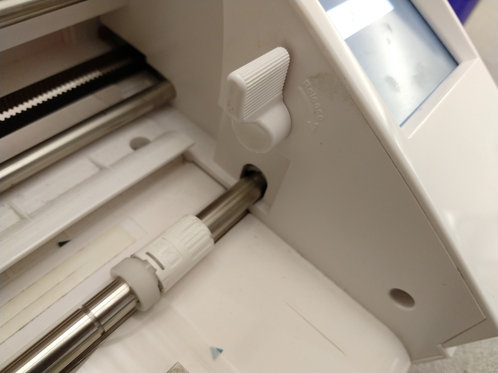

# 🌈 Full Color Stickers

### **Making Full Color Stickers**

1. **Log into one of the EDGE Lab computers using the login credentials displayed on the terminal. Make sure the computer is connected to one of the Sihouette Cameo vinyl cutters.**&#x20;
2. **Find the image(s) you want to make a sticker of**. Most people find images online, but you can also use original artwork or photos. If you want to use an image saved on your phone, email the photo to yourself.
3. **Once you’ve found the image(s), download to the desktop by right clicking the image and selecting “Save Image As”**
4. **Open Silhouette Studio on the computer by clicking the**  **icon, or by typing “Silhouette Studio” in the search bar “**.png>)
5.  **In Silhouette Studio, click the Page Setup icon**.png>) **to open the Page Settings**

    a. Set the Size to Letter

    b. Set the Cutting Mat to Cameo 12 x 12

    c.Click the Registration Mark icon .png>) and set to **On**

    The paper should now have a crosshatch pattern along the top and on the bottom left corner

.png>)

6. **Place your image into Silhouette Studio by going to File -> Merge and selecting the image you saved.**
7. **Resize your image**
   1. Click the image once, drag any of the corner squares to get the sticker to the size you want
   2. Make sure that the image is not too close to the crosshatch or the red border.
   3. If you’re placing multiple images repeat steps 5 and 6. **Be sure to leave some space between each of the images** (as you’ll be creating border cut lines later).

8. **To print, go to File -> Print. When the Print window pops up, select Print@Helix (for the color printer).**
9. Click on **Preferences** and make sure that it's set to "color" (not black and white).
10. Click on the **Paper Source** tab and select **Multi-purpose Tray**.
11. On **Paper Type,** click Settings and select the Labels option
12. Click **Print** to send your file to the printer. A "Cost Center" pop-up will appear. Choose "General Printing" (or "Assets" if you're printing during Aspire time).&#x20;
13. **Take a sheet of Sticker Paper and locate the big Canon Uniflow printer on the other side of the library**
14. **Log in to the printer with the code 381.**

Select “**Secure Print**” and select either "General Printing" or "Assets"

Open the **Multi-purpose tray on the side of the printer and place the sticker paper, making sure the printable side is facing down.**

.jpeg>)

Select the document you want to print and Select “**Print Jobs**”

15. **Return to the EDGE Lab computer and get a cutting mat**
16. Make sure the arrow on the cutting mat is pointing up

17. Align the bottom left corner of the paper with the the 11 inch line and the left borderline on the cutting mat

18. Make sure the paper is lying flat on the cutting mat
19. Place small pieces of tape on the top, bottom, and right side of the paper
20. **Turn on the Cameo and load the paper into the Cameo**

Align the left edge of the cutting mat with the blue line inside the Cameo

Unlock the rolling bar

Move the white right roller to the right corner of the cutting mat and lock the rolling bar

Press the **load** button on the Cameo screen to load the paper, making sure that the cutting mat stays aligned

.jpeg>)

If the cutting mat loads crooked, hit the unload button on the screen and load the paper again

21. **Return to Silhouette Studio to give your images an outline for the Cameo to cut**

&#x20;      **If your image is a square**:

Click on the image and then select the **Offset Pane**l 

Then click on **Offset** to give the image a red border around it (which tells the Cameo where to cut).

.png>)

**If your image is NOT a square:**&#x20;

Click the Trace Panel 

Click Select Trace Area 

Click and drag to highlight your whole image

Click **Trace Outer Edge** 

Move the image away and you will see the trace result of the image

Select the outline and select the Offset Panel 

Then click on Offset  to create a red border around the trace (this tells the Cameo where to cut).&#x20;

**Select the trace result (inner border) and delete it to keep only the offset (outer border).**

22. &#x20;**Send the file to be cut**

In Silhouette Studio, click **Send** on the upper right 

Select **Line** 

On the material option, scroll down until you see the **sticker outside** option

**IF the option is not there, you’ll need to add it:**

Click Add New Material Type

Name it Sticker Outside

Set the Speed to 6 and the force to 28

Click Save and close the Materials window

Now select the sticker outside option

Click the **Send** button on the bottom, and the Cameo will start to cut the images

23. **Remove the stickers**

When the Cameo is done cutting, press the **Unload** button on the Cameo

Take the paper of the cutting mat and your stickers should stay on the mat

Take them off the mat, and they’re ready to be peeled!
