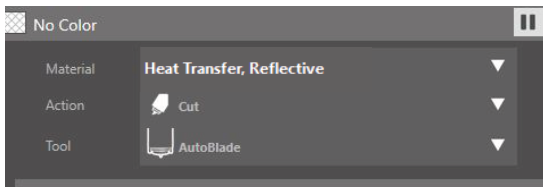

# 👕 Heat Transfer Vinyl / Heat Press

### Preparing the Design:

1. **Log into an EDGE Lab computer that's connected to one of the Silhouette Cameo Vinyl Cutters. Then, find the image(s) you want to make a heat transfer out of**. For best results, use images that are a single color, with clear lines and little interior detail.
2. **Once you've found the image, download it to the desktop by right clicking the image and selecting "Save Image As"**
3. **Open Silhouette Studio on the computer by clicking the** .png>) **icon, or by typing “Silhouette Studio” in the search bar “**.png>)
4. **In Silhouette Studio, click the Page Setup icon**.png>) **to open the Page Settings**

Set the **Size to Auto**

Set the **Cutting Mat to None**

Click the **Registration Mark** icon .png>) and set the **Style to Off/None**

The design area should be blank with a red border

5. **Place your image into Silhouette Studio by going to File -> Merge…**
6. **Resize your image**

Click the image and drag any of the corner squares to get the image to the size you want

Make sure that the image is not too close to the red border. (For best results, leave at least a half inch margin between the image and the border)

.png>)

7. **Outline image for the Cameo to cut**
8. Click the **Trace Panel** .png>)
9. Click **Select Trace Area** .png>)
10. Click and drag to highlight your whole image

.png>)

11.Click **Trace** .png>)

12. Move the image away and you will see the trace result of the image

.png>)

13. **Mirror the Image.** For heat transfers, the image must be mirrored before being sent to cut
14. Select the trace result
15. Right click and select **Flip Horizontally**

.png>)

The Image will be mirrored

.png>)

16. **Load the Vinyl into the Silhouette Cameo machine.**
17. Take the heat transfer vinyl, and make sure there is enough room for your design. It should be at least 2 inches wider and taller than your design

**Make sure that when loading the vinyl into the Cameo, the matte side is facing up**

16. Open the top of the Cameo and place the vinyl
17. Align the left edge of the vinyl with the blue guide line inside the Cameo

.jpeg>)

Unlock the rolling bar

.jpeg>)

Move the white right roller to the right corner of the vinyl and lock the rolling bar

.jpeg>)

Press the load button on the Cameo screen to load the vinyl, making sure that the cutting matt stays aligned

If the vinyl did not stay aligned (if it slips or loads at an angle) hit the unload button on the screen and load the paper again

18. **Send the file to be cut**
19. Click **Send** on the upper right .png>)
20. Select **Simple** .png>)
21. Under the **“material”** option, scroll down until you see the Heat Transfer options. Select **Heat Transfer, Reflective**

22. Click the **Send** button on the bottom and the Cameo will start to cut the images
23. **Unload and Weed the Vinyl**

When the Cameo is done cutting, press the Unload button on the Cameo

Take the vinyl and cut a rectangle around the design

**Turn the vinyl matte side up**, take a weeding tool, and peel away any vinyl you don’t want on your design.

### **Using The Heat Press**

1. Open the Heat Press
2. Turn the Heat Press on
3. Set the temperature to 305 degrees and the timer to 15 seconds. It will take the press a few minutes to reach the correct temperature.
4. **NOTE: The top plate of the heat press will be VERY hot.** The bottom plate should be safe to touch. Please be careful.
5. Once it’s reached temperature, carefully place your fabric on the bottom plate of the press. Make sure the fabric has no folds and that the part of the fabric where the design will be placed is centered.
6. **Take some teflon paper and place it on top of the fabric.**
7. Close the heat press and press the fabric for 5 seconds then open the heat press. This is done to remove any wrinkles on the fabric.
8. Remove the teflon paper
9. Place the vinyl on the fabric where you want the design, making sure that the **sticky side is facing the fabric**.
10. Place the teflon paper on the fabric
11. Close the heat press and press the fabric for 15 seconds.
12. After the 15 seconds are up, open the heat press and remove the teflon paper.
13. Slowly remove the plastic from the vinyl, making sure that the vinyl stays on the fabric. If the vinyl is not staying on the fabric, place the teflon paper back on the fabric and press it again.
14. Once all of the plastic has been removed from the vinyl, take the fabric off the heat press and **turn the heat press off**.
