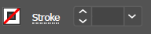
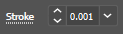

# 🎨 Preparing your design

### **Choosing the Design**

Start by choosing a design / text to laser cut. Any design must be prepared so that the laser cutter software can “translate” it in order to cut. Please note the requirements below:

**Text**

Text is the easiest to prepare. The only requirement is that the text should have a pure black fill. (Most preloaded fonts work fine.)

**Logos, Clipart, Black and White designs**

Most designs that are found on the Internet will require alterations so that they can be used. Most of these designs will have colors, so they must be converted to black and white using Adobe Illustrator.

**Pictures**

Pictures can’t be prepared in Adobe Illustrator. Instead, we have to use the ULS Photo software. See the Laser Images guide for instructions on how this is done.

### **Preparing Designs in Adobe Illustrator**

* Open Adobe Illustrator and create a new document
* Select the **Letter** preset and **make sure that the dimensions are in inches**

.png>)

* Click the **Advanced Options** and set the **Color mode to RGB** then click **Create**

.png>)

* When the document is created, you will see the following window

.png>)

* On the left you have the **Tools** panel, where you will find the tools to create designs. At the center is the **Work** window where the **Artboard** is and where the design will be made. On the right is the **Properties** window where you can change the properties of the Artboard as well as the properties of the objects used on the design.

**Setting up a Text Design**

* Begin by adding text using the The Type Tool.  This is used to add text to the design. To add text, click anywhere on the screen while the Type tool is active and a text box will appear with some random text. To replace the text, just highlight the text and type your own text.
* To change the size of the text, click on the Selection Tool . This tool is used to select the different objects placed in your work window. To select an object, simply click on it while using the selection tool. If you click and hold on an object you are able to move the object around freely with your mouse.
* To change the size of text, click on it once, then drag any of the white boxes that appear around the text.

**Setting up Image Designs**

* Images can be found using Google Chrome and saving them to the computer.
* The best images to use are those that are **black and white** or that have just 1 or 2 colors. The best way to search is to look for clipart (for example “soccer ball clipart”). Logos are also a good option since they typically don’t have many colors.
* To add an image to Illustrator, go the **File->Place**, then locate the image that will be added. Although the image is selected, it will not be placed right away, it will move around with the cursor. Click on the location you’d like the image on the artboard, and the image will be placed there.
* **Image Trace:** This turns the image into a vector image which allows us to manipulate and keep the quality of the image regardless of what you do to it. To do this, select the image then press the **Image Trace** button on the Properties window. Then, choose **Black and White** tracing.
* **Expand**: Once the image has been traced, you have to adjust it so that it can be interacted with like any other object created in Illustrator. To do this, select the image that was traced and click the **Expand** button on the properties window. This will allow us to ungroup the image and erase the background.
* **Ungroup**: Ungrouping the image will separate the image based on which lines are touching and their color. (Lines that are the same color and touching each other will be grouped together.)
* **Delete the Background**: Click the background of the image and press the delete key.

### **Understanding the Laser Cutter & Colors**

The laser cutter only recognizes the colors Red, Blue and Black. By using RGB color values, we’re able to get those true colors instead of an approximation that CMYK values would give us. The laser cutter works by passing a laser over the material to engrave the design on it. The colors red, black and blue tell the laser cutter what it should do. The colors work as follows:

* **Black** (RGB values R=0, G=0, B=0)
  * This is used for the **Fill** color of the design and will cause the laser cutter to burn the design on the material, making a low cut on the material.
* **Blue** (RGB values R=0, G=0, B=255)
  * This is used for the **Stroke** color of the design and will cause the laser cutter to engrave the outline of the design on the material, making deep cuts on the material. The thickness of the stroke must be set to .001
* **Red** (RGB values R=255, G=0, B=0)
  * This can be used for the **Stroke** color of the design or for the stroke of a shape around the design and will cause the laser cutter to cut through the material. The thickness of the stroke must be set to .001
  * **NOTE: the laser cutter cannot cut through every type of material.** If you’re planning to cut something other than the birch wood sheets, please consult the EDGE Lab Facilitator or a TA.

### **Changing Fill Color**

The Fill color is the color that is used on the inside of an object. Since we are laser cutting, the fill color must be set to **BLACK**

1. Select the object that you want to change the color of.
2. Click the .png>) option on the properties window on the right side of the screen.
3. Select the Color Mixer Option

.png>)

1. Slide all the sliders to the left so that the value on each reads 0 (RGB values R=0, G=0, B=0)
2. This has to be done for every object on the design

### **Changing the Stroke Color**

Giving your design a stroke color of blue makes it pop out more once it is done.

Giving your design a stroke color of red tells the laser cutter that the design has to be cut out from the material. This can’t be done with every material. (Material such as metal, granite, etc can’t be cut through so you can’t add a stroke to the design.)

**Setting the Stroke to Make Design Pop Out**

1. Select the object that you want to change the stroke color of.
2. Click the .png>) option on the properties window on the right side of the screen.
3. Select the **Color Mixer** Option

.png>)

1. Since we want to make the design pop out, we have to change the stroke color to **blue.** Slide the B slider all the way to the right so that it reads **255**, and slide the R and G slider all the way to the left so that they read **0**.
2. Set the **thickness of the Stroke to .001**

.png>) .png>)

**Setting the Stroke to Cut Out the Design**

1. Select the object that you want to change the stroke color of.
2. Click the  option on the properties window on the right side of the screen.
3. Select the **Color Mixer** Option

.png>)

1. Since we want to make the design cut out, we have to change the stroke color to **red**. Slide the R slider all the way to the right so that it reads **255**, and slide the B and G slider all the way to the left so that they read **0**.
2. Set the **thickness** of the Stroke to **.001**

.png>) 

### Save your design

The whole design must fit in the artboard. If part of the design is outside of the artboard, the artboard must be resized to fit the design OR the design must be resized to fit the artboard. If everything fits okay, save your design in Illustrator.

Next, see the “[Using the Cutter](using-the-cutter.md)” tutorial for instructions on how to send your design to the cutter and finish your project!
