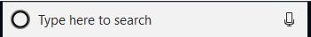
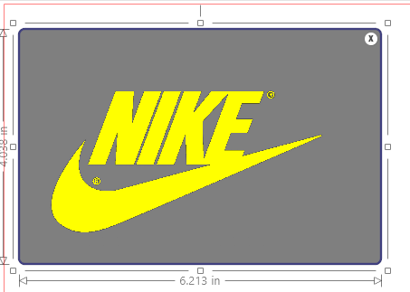
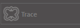
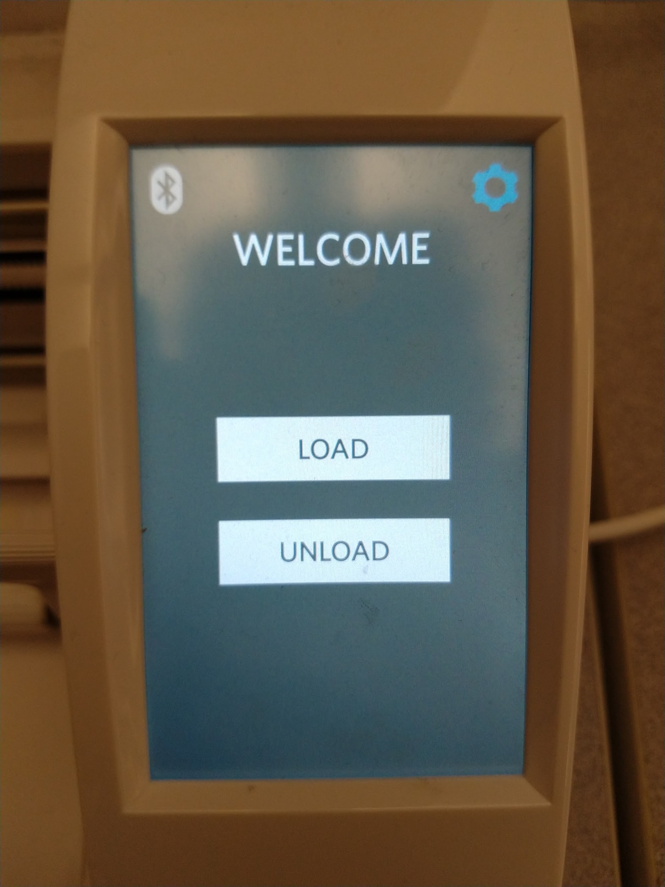
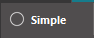
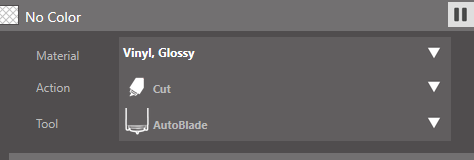
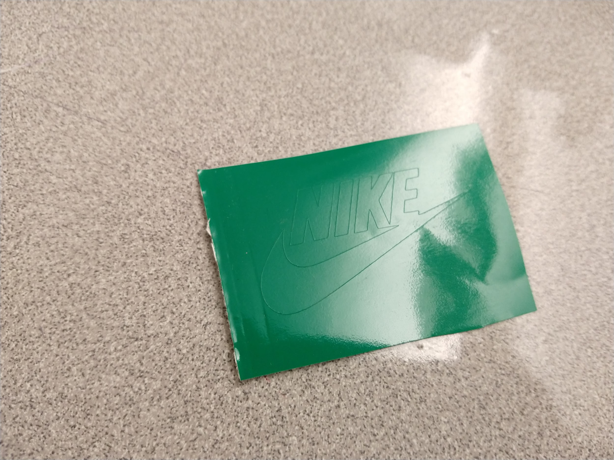
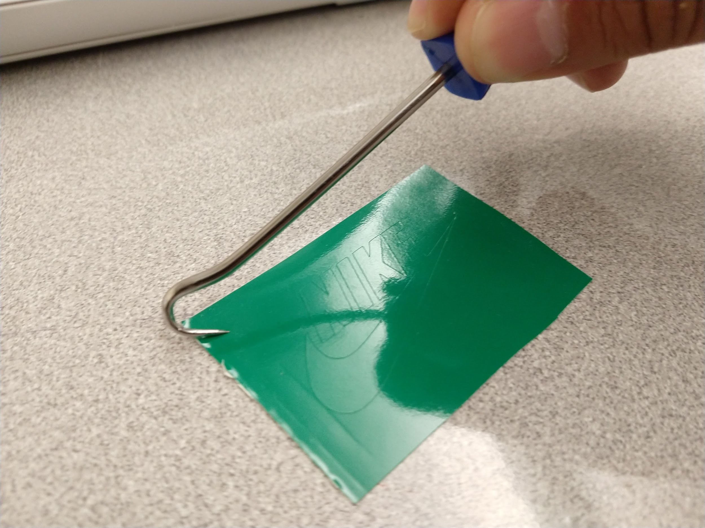

# ☀ Vinyl Stickers

### **Making Vinyl Stickers**

1. **Log onto one of the EDGE Lab computers that’s connected to a Silhouette Cameo vinyl cutter.**
2. **Find the image(s) you want to make a sticker out of**. For best results, use images (such as logos) that have clear, solid lines and are a single color. Your design will be cut (not printed) on a sheet of vinyl that is just one color, so (even if there are multiple colors in the image) your sticker will be just one color.
3. **Once you’ve found the image(s) download them to the desktop by right clicking the image and selecting “Save image as.”** When prompted, give your image(s) a name and save to the computer.
4. **Open Silhouette Studio on the computer by clicking the** .png>) **icon, or by typing “Silhouette Studio” in the search bar “**
5. **When Silhouette Studio opens, click the Page Setup icon**.png>) **to open the Page Settings**

Set the **Size to Auto**

Set the **Cutting Mat to None**

Click the **Registration Mark** icon .png>) and set the **Style to Off/None**

The design area should be blank with a red border

.png>)

6. **Place your image into Silhouette Studio by going to File -> Merge**
7. A window will pop-up, select the Desktop, and select your image
8. **Resize your image**

Click the image once, & drag any of the corner squares to get the image to the size you want

Make sure that the image is not near the red borderlines.

.png>)

9. **Outline the image**

Click the **Trace Panel** .png>)

Click Select **Trace Area** .png>)

Click and drag to highlight your whole image

Click **Trace** 

Move the image away and you will see the trace result of the image

.png>)

10. **Load the sheet of vinyl**

Take a sheet of vinyl, and make sure there is enough room for your design to fit on it. It should be about 2 inches wider and taller than your design

Open the top of the Cameo and place the vinyl along the bar

Align the left edge of the vinyl with the blue line inside the Cameo

.jpeg>)

Unlock the rolling bar

.jpeg>)

Move the white right roller to the right corner of the vinyl and lock the rolling bar

.jpeg>)

Press the load button on the Cameo screen to load the vinyl,making sure that it loads straight

If the vinyl loads crooked, hit the unload button on the screen and load the paper again

11. **Send the file to be cut**

In Silhouette Studio, click **Send** on the upper right .png>)

Select **Simple** 

On the **Material** option scroll down until you see the Vinyl options

Make sure to select the correct type of vinyl you are using (i.e Glossy or Matte)

Click the **Send** button on the bottom and the Cameo will start to cut the images

12. **Unload the stickers**

When the Cameo is done cutting, press the Unload button on the Cameo

Take the vinyl and cut a rectangle around the design

Take a weeding tool and poke out any vinyl you don’t want on your design

13. **Apply Transfer Paper.**&#x20;

Cut out a rectangle that fits around your design, then peel off the transfer paper and apply the sticky side to your design.&#x20;

Smooth out the transfer paper, making sure to remove any air bubbles.&#x20;

Once all the air bubbles are out, you’re ready to apply your sticker. Just peel off the transfer paper and your design should stick onto the transfer paper. Stick your design where you want it. Peel off the transfer paper, and your design should now stay where you want it.

