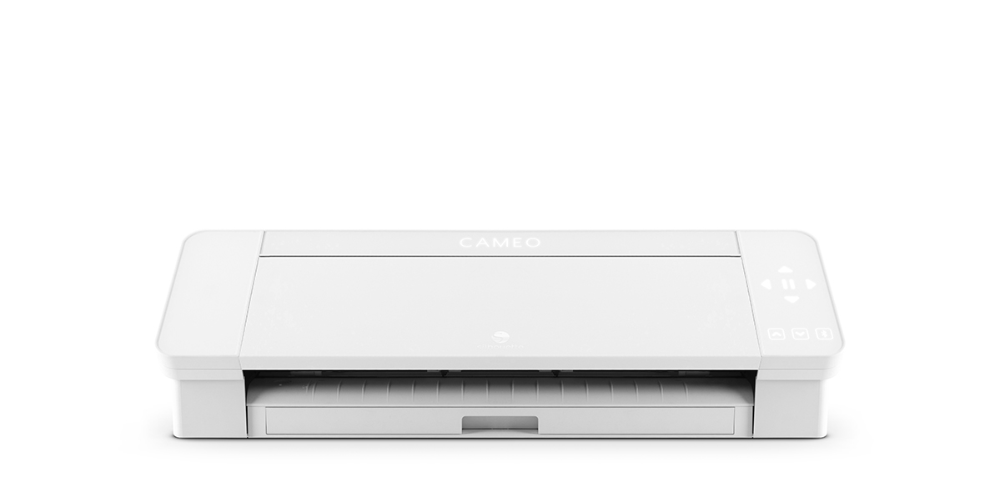
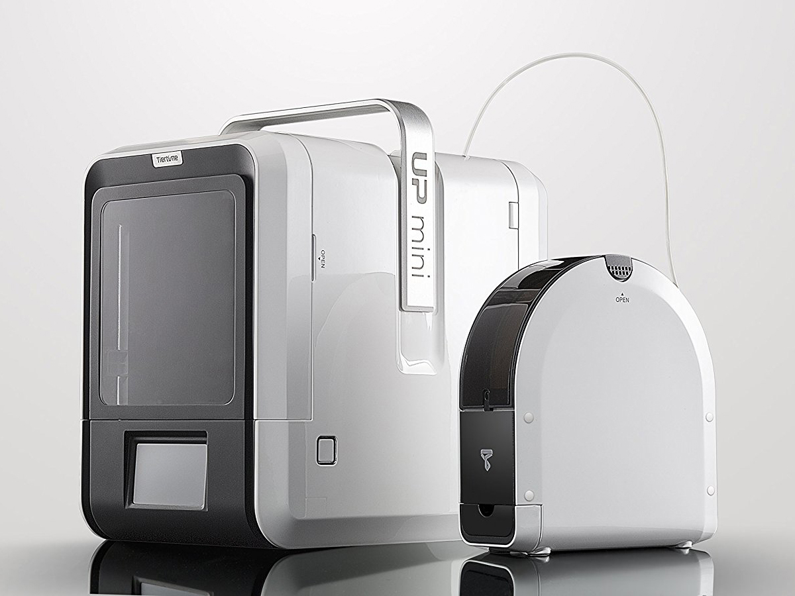
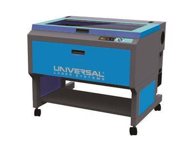
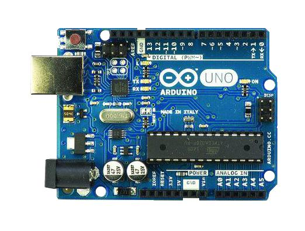

# 🖨 Equipment

### Stickers & Heat Transfers

<figure><figcaption>
Silhouette Cameo Vinyl Cutter (for stickers and heat transfers)
</figcaption></figure>

<figure><figcaption>
Heat Press (for t-shirts, etc)
</figcaption></figure>

### Buttons&#x20;

<figure><figcaption>
Button Press
</figcaption></figure>

### 3D Printers

<figure><figcaption>
UP Mni 2 (print bed = 4.7" x 4.7" x 4.7") 
</figcaption></figure>

<figure><figcaption>
MakerBot Replicator 2 (print bed = 11.2 L x 6.1" W x 6" H)
</figcaption></figure>

<figure><figcaption>
LulzBot Taz 6 (print bed = 11" x 11" x 9.8") 
</figcaption></figure>

### 3D Pens

<figure><figcaption>
3Doodler Create
</figcaption></figure>

### Laser Cutting

<figure><figcaption>
Universal Laser Systems VLS 6.60
</figcaption></figure>

### Arduino

<figure><figcaption>
Arduino Uno (and components, sensors, etc)
</figcaption></figure>
