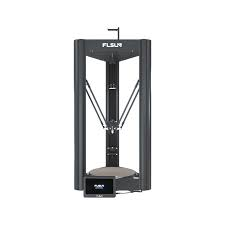
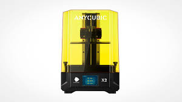
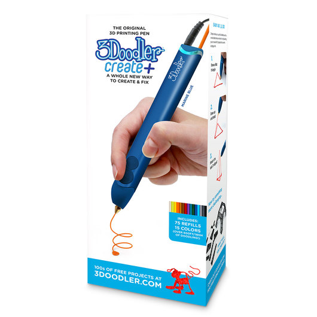

# 🖨️ Equipment

### Vinyl Cutter, Sublimation Printer & Heat Press

<figure><figcaption>
Silhouette Cameo Vinyl Cutter (for stickers and heat transfers)
</figcaption></figure>

<figure><figcaption>
Heat Press (for t-shirts, etc)
</figcaption></figure>

### Button Press&#x20;

<figure><figcaption>
Button Press
</figcaption></figure>

### 3D Printers

<figure><figcaption>
FLSUN T1 (print bed =<em>10.24 x 10.24 x 12.99 in</em>) 
</figcaption></figure>

<figure><figcaption>
MakerBot Sketch (print bed = 8.66" x 7.87" x 9.84") 
</figcaption></figure>

<figure><figcaption>
MakerBot Replicator 2 (print bed = 11.2 L x 6.1" W x 6" H)
</figcaption></figure>

<figure><figcaption>
LulzBot Taz 6 (print bed = 11" x 11" x 9.8") 
</figcaption></figure>

<figure><figcaption>
Prusa i3 MK3S (print bed = 9.84" x 8.3" x 8.3")
</figcaption></figure>

<figure><figcaption>
Elegoo Mars 5 Resin Printer (build plate =(6.04" x 3.06" x 6.49" )
</figcaption></figure>

### 3D Pens

<figure><figcaption>
3Doodler Create
</figcaption></figure>

### Laser Cutter

<figure><figcaption>
Universal Laser Systems VLS 6.60
</figcaption></figure>

### Arduino

<figure><figcaption>
Arduino Uno (and components, sensors, etc)
</figcaption></figure>
