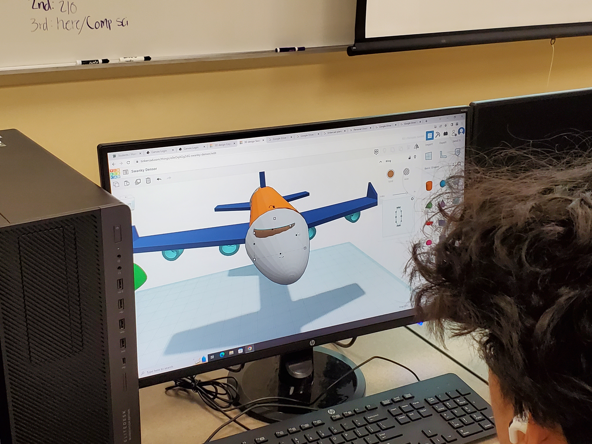
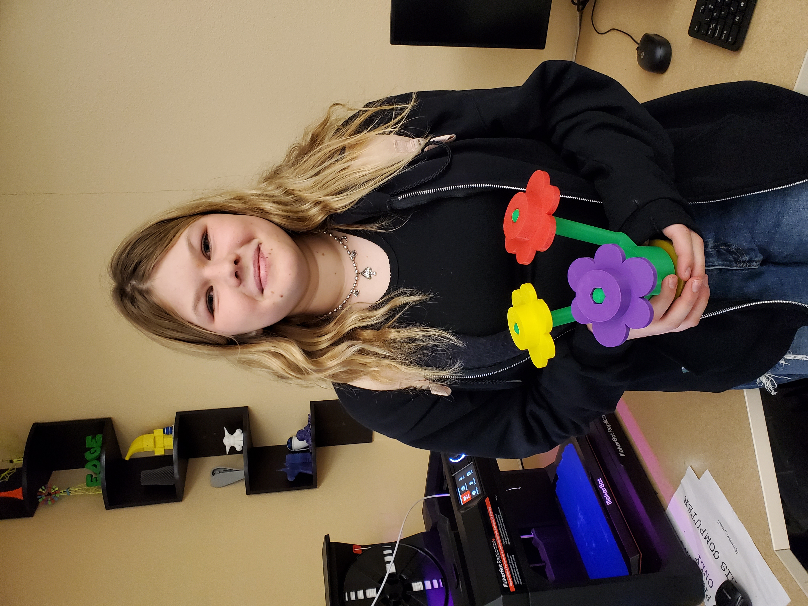
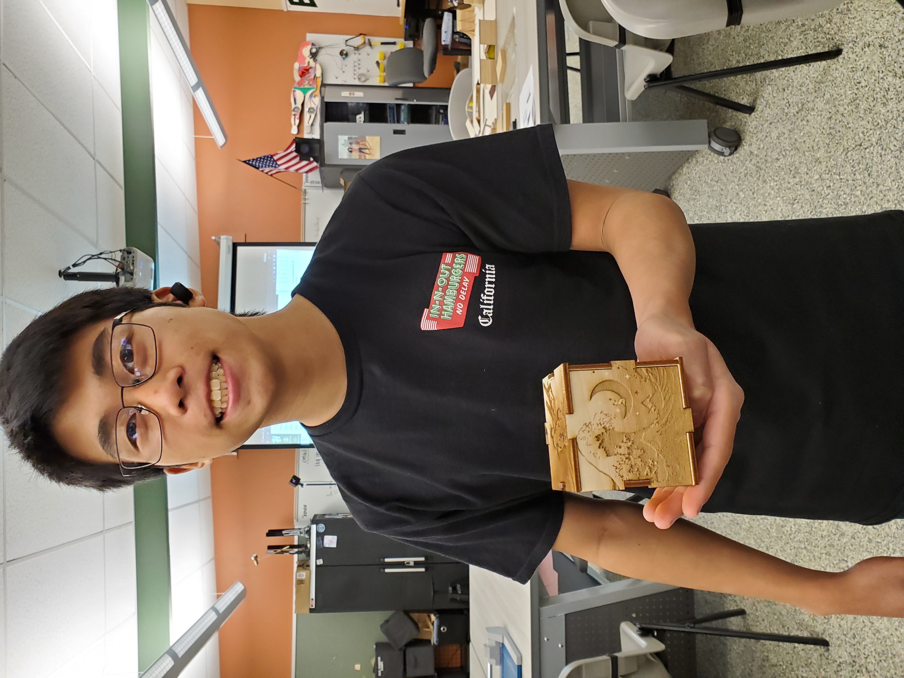
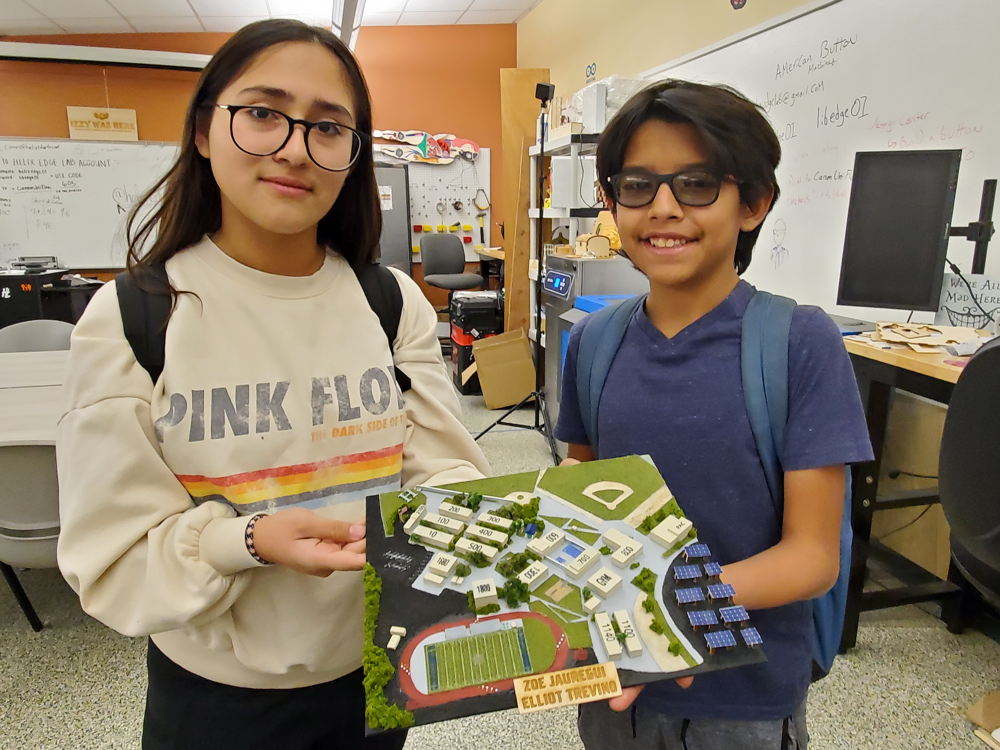
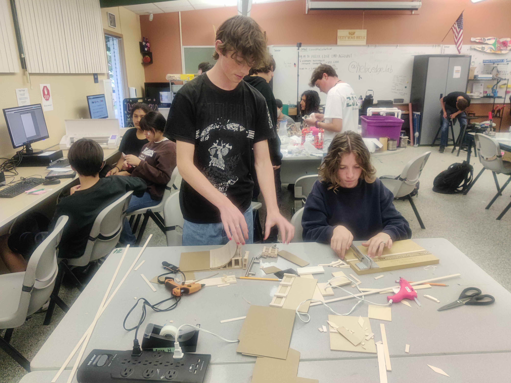

# 📷 Project Gallery

## EDGE Lab Projects

Check out our [Tutorials page](../getting-started/tutorials-how-to/) for instructions on how to get started!&#x20;

<figure><figcaption>
Arduino VR Glove
</figcaption></figure>

 

<figure><figcaption>
Custom t-shirts
</figcaption></figure>

<figure><figcaption>
Laser cut honeycomb (designed on a drawing tablet)
</figcaption></figure>

 

<figure><figcaption>
Custom 3D face mask modeled in Blender
</figcaption></figure>

<figure><figcaption>
3D Modeling in Tinkercad
</figcaption></figure>

 

<figure><figcaption>
Birdcage and bird made with 3D pens
</figcaption></figure>

<figure><figcaption>
3D printed "LEGO" flowerpot
</figcaption></figure>

 

<figure><figcaption>
Laser cut cube with custom designs
</figcaption></figure>

<figure><figcaption>
3D map of the Helix campus
</figcaption></figure>

 

<figure><figcaption>
Mini skate park made of laser cut pieces
</figcaption></figure>

<figure><figcaption>
T-shirt press
</figcaption></figure>

 

<figure><figcaption>
T-shirts and buttons 
</figcaption></figure>

<figure><figcaption>
Resin chess pieces for custom set
</figcaption></figure>

 

<figure><figcaption>
Arduino-controlled claw
</figcaption></figure>

